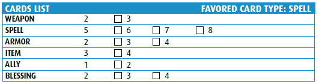

# Darago's Equipment

## Allies

## Armor
 

## Blessings
 

## Items
  

## Spells
    

## Weapons
 

[characters](../p1/characters.md#characters)

[available gear](available_loot.md#available-gear)
