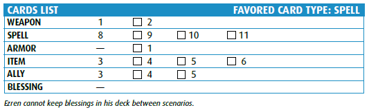

[Main Page](main.md#wrath-of-the-righteous)

# Characters

## Darago

The power of the dead courses through Darago’s thin veins. It’s a rare wizard who can traffic
with the unliving and retain most of his soul, but so far, Darago has resisted the baser desires
of most necromancers. Still, his chilling voice and devilish sense of humor will surprise even
the most hardened adventurers. After all, he will happily battle at the side of any adventurer
while she lives… and perhaps for a short time thereafter.

## Ezren

After learning that the father whose name he’d spent most of his adult life trying to clear
was indeed guilty, Ezren abandoned his former life and became a wizard. Finding no masters
willing to take on an apprentice of his age, he devoted himself to unlocking the mysteries of
magic alone. His studies soon revealed a true aptitude for the arcane arts, and he now seeks to
explore the world he neglected for so long.

## Harsk

Harsk has always been an unusual sort of dwarf, preferring open skies to cramped underground
halls, the flexibility of a crossbow to the sturdiness of an axe, and tea to ale—it keeps his senses
sharp. A gruff and driven dwarf, he left his home to fulfill a vow of justice to avenge his brother’s
death at the hands of raiding giants. He has since learned much of the world, its lands, its beasts,
and its vast array of people and places worth protecting.

## Imrijka

Half-orc orphans aren’t a common sight in the church of Pharasma, goddess of fate and death. But
Imrijka isn’t a common half-orc. Taken in by the church’s high exorcist and trained as an inquisitor,
Imrijka brings judgment to all who would violate the laws of life and death, keeping close a
mysterious disk that might hold the key to the truth of her parentage. Imrijka’s seen it all. She
faces the future with courage and faith.

[Main Page](main.md#wrath-of-the-righteous)
