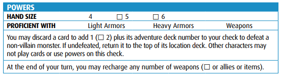
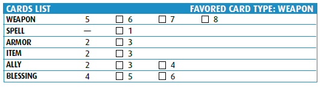

[Main Page](main.md#wrath-of-the-righteous)

# Characters

The power of the dead courses through Darago’s thin veins. It’s a rare wizard who can traffic
with the unliving and retain most of his soul, but so far, Darago has resisted the baser desires
of most necromancers. Still, his chilling voice and devilish sense of humor will surprise even
the most hardened adventurers. After all, he will happily battle at the side of any adventurer
while she lives… and perhaps for a short time thereafter.

[Equipment](../c1/darago_equipment.md#daragos-equipment)

[Printable Sheet (External)](https://drive.google.com/file/d/17asnXhsprpi6-P-a6GhqkhU_K6whwiid/view?usp=sharing)

## 

Formerly known as Sir d'Esparnon, Felix was stripped of land and title after an unfortunate 
misunderstanding that resulted in the slaughter of a village... full of peasants. Refusing to accept
responsibility for the incident, or the humanity of said peasants; Felix now travels across the land upon his noble steed "Donahan", seeking
to restore the glory he once knew.

Equipment

Printable Sheet (External)

## 

Harsk has always been an unusual sort of dwarf, preferring open skies to cramped underground
halls, the flexibility of a crossbow to the sturdiness of an axe, and tea to ale—it keeps his senses
sharp. A gruff and driven dwarf, he left his home to fulfill a vow of justice to avenge his brother’s
death at the hands of raiding giants. He has since learned much of the world, its lands, its beasts,
and its vast array of people and places worth protecting.

Equipment

[Printable Sheet (External)](https://drive.google.com/file/d/1EjdbCkJISLBc5EwvzBOKq44pn0hV09UR/view?usp=sharing)

## 

Half-orc orphans aren’t a common sight in the church of Pharasma, goddess of fate and death. But
Imrijka isn’t a common half-orc. Taken in by the church’s high exorcist and trained as an inquisitor,
Imrijka brings judgment to all who would violate the laws of life and death, keeping close a
mysterious disk that might hold the key to the truth of her parentage. Imrijka’s seen it all. She
faces the future with courage and faith.

[Equipment](../c1/Imrijka_equipment.md#imrijkas-equipment)

[Printable Sheet (External)](https://drive.google.com/file/d/1M7yW4PQKLOa13ijyZLNwdYAVWmJeNrXM/view?usp=sharing)

## 

[Main Page](main.md#wrath-of-the-righteous)
