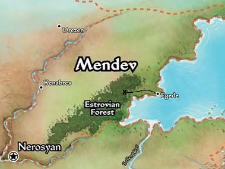

### Links
- [External: Rule Book](https://tesera.ru/images/items/559855/PZO6020-Rulebook.pdf)
- [External: Dice Roller](https://g.co/kgs/ooVcz5)
- [External: Dice Odds](https://barry4356.pythonanywhere.com/dice_guesser)
- [characters](characters.md#characters)

# The Elven Entanglement

After defeating Sophini and her demon cult, our Fellowship of adventurers gather their new allies and loot, deciding to answer the call of Queen Galfrey and travel to the city of Kenabres (where there will surely be even more loot).

While common wisdom is to avoid the Estrovian Forest, the adventurers believe their dwarven ranger more than capable of navigating the twisted woods. Upon entering the woods, the adventurers meet an uprooter elf who asks for their help; The toad demon Fihralaz has captured the Satyr Vinst, and has begun spreading havoc accross the wilderness. Can our adventurers remove this taint from the forest?

 

  

## Timer (30)

## Locations

### Dark Forest (9)

### Watchtower (9)

### Wounded Lands (9)

### Cemetery (9)

### Abyssal River (9)

### Guardpost (9)

## Darago's Cards: Sarah (15)

## Ezren's Cards: Barry (15)

## Harsk's Cards: Lindsey (15)

## Imrijka's Cards: Caleb (15)

### Links
- [External: Rule Book](https://tesera.ru/images/items/559855/PZO6020-Rulebook.pdf)
- [External: Dice Roller](https://g.co/kgs/ooVcz5)
- [External: Dice Odds](https://barry4356.pythonanywhere.com/dice_guesser)
- [characters](characters.md#characters)
