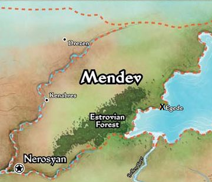

# The Godless Ones

## Story

The people of Egede have a problem... A cult of Demon worshipers, under the leadership of the demonologist [Sophini](../sophini.md), have taken up residence in the outskirts of town. After dark, demons have been raiding the farms and settlements of the villagers outside the town walls, and they grow bolder by the day.
The townsfolk have started a fund, payable to any noble heroes who answer their call and vanquish the monsters (and their human allies).
Four noble heros, Ezren the blue wizard, Harsk the dwarf ranger, Imrijka the half-orc Inquisitor, and Darago the death wizard, hear the plight of the villagers and decide to work together to rid the land of this blight...

Working together, our four heroes manage to hunt down Sophini's alcolytes one by one. The villain Sophini nearly escaped, evading one assault after another, but she was finallhy pinned in a cordinated attack by all four heroes. After destroying the cult leader and her minions, the heroes meet in a local tavern to divide up the loot and discuss working together in the future. Ezren, refusing to give up his personal freedom, declined the group and traveled North alone. Over-hearing our heroes from across the bar, a human ex-knight named Felix approached and offered to join. In talking about his recent travels, Felix mentioned the call of queen Galfrey, requesting any heroes in search of glory travel to Kenabres to assist with the defense of the city against the demon hordes. After a brief discussion, Felix is accepted into the Fellowship...
 
## Locations

## Links
- [Main Page](../main.md#wrath-of-the-righteous)
