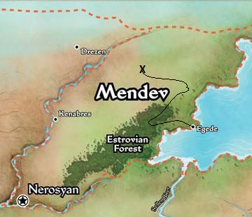
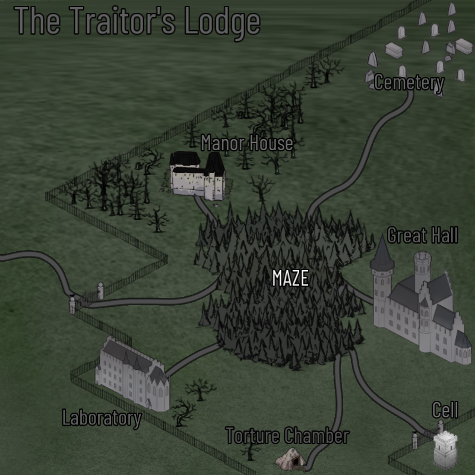

# The Traitor's Lodge

As our heroes approach Thurl's mansion, it becomes clear that the powerful summoner has been absent for some time.
The grounds are overgrown, and overrun by all manner of monsters. Our heroes consider avoiding the area and continuing the hunt for Thurl himself...
But the prospect of all the potential loot proves enough to entice our adventurers into the frey. Surely the monsters left behind can't be a match for our heroes...

## Villain

## Henchmen
  
 
## Locations

##

     

## Rewards

Gain all the cards under this card (the "loot-stack"), or gain no reward and you may immediately attempt this scenario again.

## Notes
- Very loot-heavy round
- Any time an undead monster is defeated, a random boon is drawn from the box
  - The player then decides if it's worth re-shuffling the monster into a location to add the boon to a "loot-stack"
  - If we win the scenario, we get to divy up the "loot-stack"
- Karsos (vilain) can only be defeated with magic...
  - If Karsos survives the fight, a new location "maze" is created, and the character is trapped there
- The loot "sacred prism" is rewarded to whoever closes the first location. There's only one copy of this card in the box

##
### Links
- [Main Page](main.md#wrath-of-the-righteous)
- [Darago's Gear](../c1/darago_equipment.md#daragos-equipment)
- [Felix's Gear](../c1/felix_equipment.md#felixs-equipment)
- [Harsk's Gear](../c1/harsk_equipment.md#harsks-equipment)
- [Imrijka's Gear](../c1/Imrijka_equipment.md#imrijkas-equipment)
