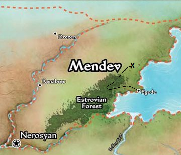
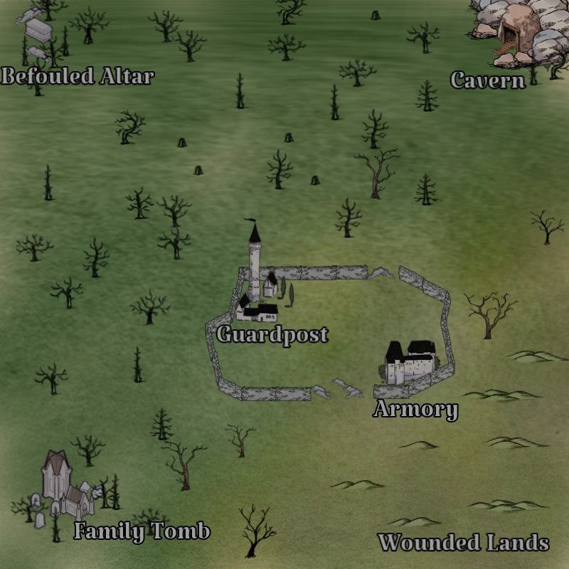

# The Wardstone Patrol

## Story

## Villain

## Henchmen

## Cohorts

 
## Locations

## Rewards

Each character draws a random soldier or hireling ally

##
### Links
- [Main Page](../main.md#wrath-of-the-righteous)
- [Darago's Gear](../../c1/darago_equipment.md#daragos-equipment)
- [Felix's Gear](../../c1/felix_equipment.md#felixs-equipment)
- [Harsk's Gear](../../c1/harsk_equipment.md#harsks-equipment)
- [Imrijka's Gear](../../c1/Imrijka_equipment.md#imrijkas-equipment)
