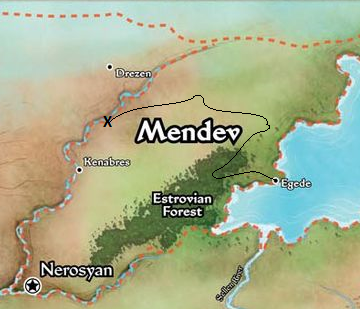
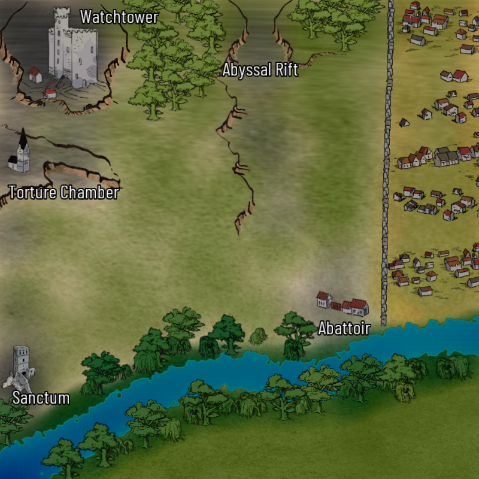

# Vengeance at Sundered Crag

Story

## Villain
 

## Henchmen

## Cohorts
 
 
## Locations

##

    
 

## Rewards

Each character chooses a type of boon other than loot and draws a random non-Basic card of that type from the box

## Notes
- The watchtower location isn't created until after the first villain is defeated, and the second villain starts in the watchtower
- This is the last scenario of the adventure, so we also get the Bonus from that adventure (finally get to check a box on our characters)

##
### Links
- [Main Page](main.md#wrath-of-the-righteous)
- [Darago's Gear](../c1/darago_equipment.md#daragos-equipment)
- [Felix's Gear](../c1/felix_equipment.md#felixs-equipment)
- [Harsk's Gear](../c1/harsk_equipment.md#harsks-equipment)
- [Imrijka's Gear](../c1/Imrijka_equipment.md#imrijkas-equipment)
