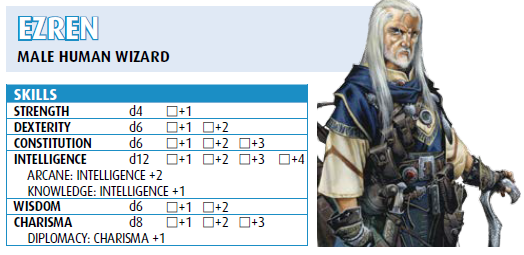
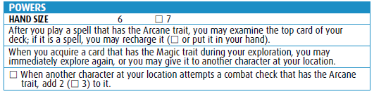
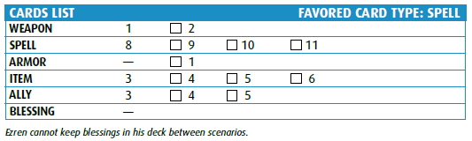
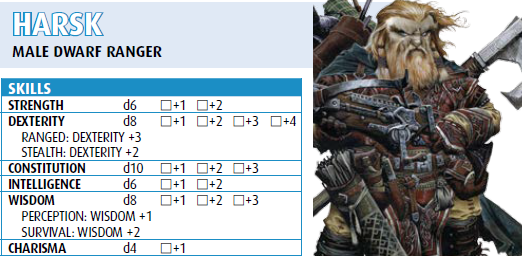
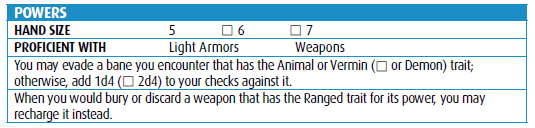
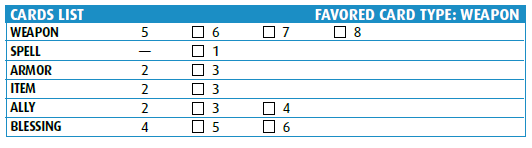

[Progress](progress.md#progress)

# Characters

## Ezren

After learning that the father whose name he’d spent most of his adult life trying to clear
was indeed guilty, Ezren abandoned his former life and became a wizard. Finding no masters
willing to take on an apprentice of his age, he devoted himself to unlocking the mysteries of
magic alone. His studies soon revealed a true aptitude for the arcane arts, and he now seeks to
explore the world he neglected for so long.

[Printable Sheet (External)](https://drive.google.com/file/d/1C_3AA4_zbUYh74QvuuTEy0TZX9otZpS1/view?usp=sharing)

## Harsk

Harsk has always been an unusual sort of dwarf, preferring open skies to cramped underground
halls, the flexibility of a crossbow to the sturdiness of an axe, and tea to ale—it keeps his senses
sharp. A gruff and driven dwarf, he left his home to fulfill a vow of justice to avenge his brother’s
death at the hands of raiding giants. He has since learned much of the world, its lands, its beasts,
and its vast array of people and places worth protecting.

[Printable Sheet (External)](https://drive.google.com/file/d/1EjdbCkJISLBc5EwvzBOKq44pn0hV09UR/view?usp=sharing)

[Progress](progress.md#progress)
